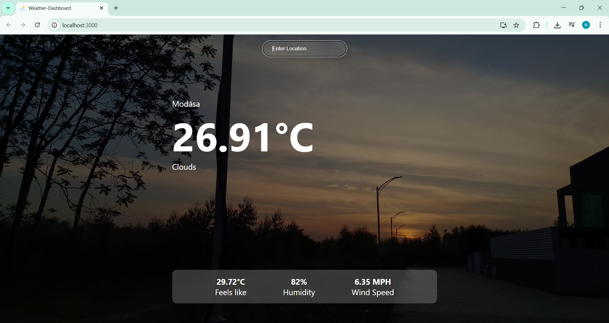

# 🌦️ Weather Dashboard

A simple and responsive weather app built with **React** and **OpenWeatherMap API**. Enter a city name to get real-time weather updates including temperature, humidity, wind speed, and weather conditions.

---

## 📸 Screenshot



---

## 🚀 Features

- 🔍 Search weather by city name
- 🌡️ Displays temperature in Celsius
- 💧 Shows humidity and "feels like" temperature
- 🌬️ Displays wind speed
- ☁️ Current weather condition (e.g., Clear, Rain, Clouds)
- 🔄 Auto-clears input field after search
- ⚙️ Built with React + Axios
- 🔒 API key stored securely in `.env` file

---

## 🛠️ Technologies Used

- **React** (useState, JSX)
- **Axios** for API calls
- **OpenWeatherMap API**
- **Environment Variables (.env)**
- HTML5, CSS3

---

## 🧪 Installation & Setup

### 1. Clone the repo

```bash
git clone https://github.com/darjinisha/Weather-Dashboard.git
cd Weather-Dashboard
```
